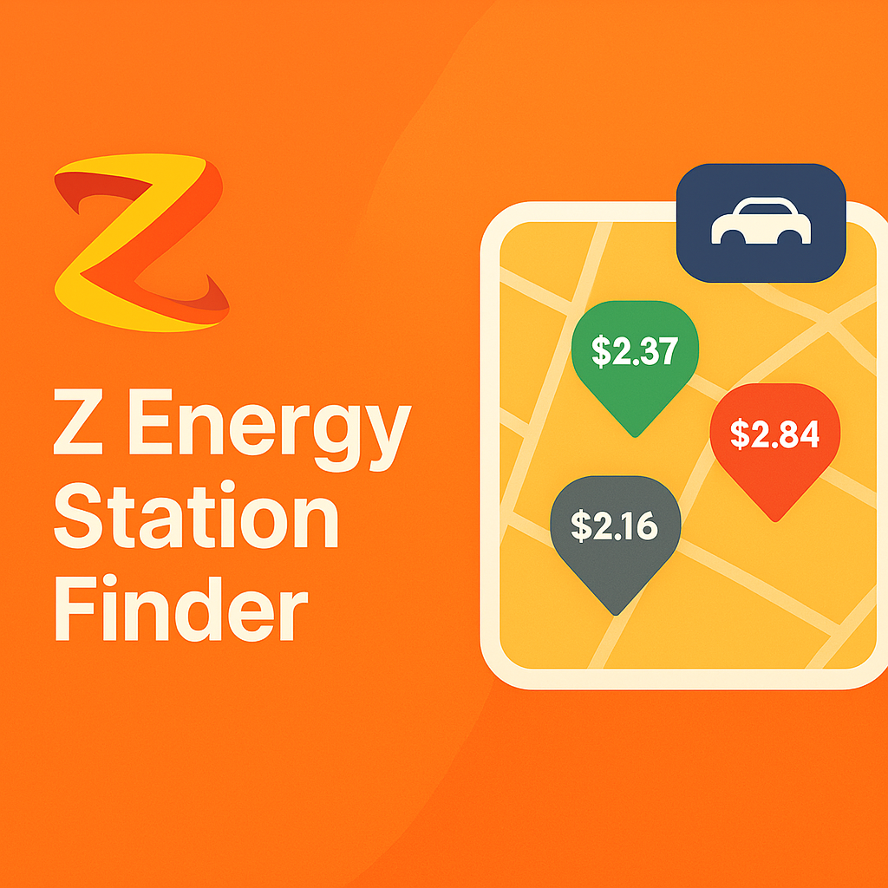

<a id="readme-top"></a>

<div align="center">

[![Contributors][contributors-shield]][contributors-url]
[![Forks][forks-shield]][forks-url]
[![Stargazers][stars-shield]][stars-url]
[![Issues][issues-shield]][issues-url]
[![License][license-shield]][license-url]
[![LinkedIn][linkedin-shield]][linkedin-url]

</div>

<!-- PROJECT LOGO -->
<br />
<div align="center">
  <a href="https://github.com/tonkatommy/MRHQ-L5-Mission-5-Phase-2-Frontend">
    
  </a>

<h3 align="center">Z Energy Station Finder</h3>

  <p align="center">
    A modern, interactive web application for finding Z Energy fuel stations across New Zealand with real-time pricing, advanced filtering, and route planning capabilities.
    <br />
    <a href="https://github.com/tonkatommy/MRHQ-L5-Mission-5-Phase-2-Frontend"><strong>Explore the docs »</strong></a>
    <br />
    <br />
    <a href="https://github.com/tonkatommy/MRHQ-L5-Mission-5-Phase-2-Frontend">View Demo</a>
    &middot;
    <a href="https://github.com/tonkatommy/MRHQ-L5-Mission-5-Phase-2-Frontend/issues/new?labels=bug&template=bug-report---.md">Report Bug</a>
    &middot;
    <a href="https://github.com/tonkatommy/MRHQ-L5-Mission-5-Phase-2-Frontend/issues/new?labels=enhancement&template=feature-request---.md">Request Feature</a>
  </p>
</div>

<!-- TABLE OF CONTENTS -->
<details>
  <summary>Table of Contents</summary>
  <ol>
    <li>
      <a href="#about-the-project">About The Project</a>
      <ul>
        <li><a href="#built-with">Built With</a></li>
      </ul>
    </li>
    <li>
      <a href="#getting-started">Getting Started</a>
      <ul>
        <li><a href="#prerequisites">Prerequisites</a></li>
        <li><a href="#installation">Installation</a></li>
      </ul>
    </li>
    <li><a href="#usage">Usage</a></li>
    <li><a href="#roadmap">Roadmap</a></li>
    <li><a href="#contributing">Contributing</a></li>
    <li><a href="#license">License</a></li>
    <li><a href="#contact">Contact</a></li>
    <li><a href="#acknowledgments">Acknowledgments</a></li>
  </ol>
</details>

<!-- ABOUT THE PROJECT -->

## About The Project

[![Z Energy Station Finder Screen Shot][product-screenshot]](https://github.com/tonkatommy/MRHQ-L5-Mission-5-Phase-2-Frontend)

[![Z Energy Station Finder Screen Shot 2][product-screenshot2]](https://github.com/tonkatommy/MRHQ-L5-Mission-5-Phase-2-Frontend)

The Z Energy Station Finder is a full-stack web application designed to help users locate Z Energy fuel stations across New Zealand. Built as part of Mission Ready HQ's Level 5 Advanced Development course, this project demonstrates modern web development practices and real-world application architecture.

### Key Features

- **Interactive Google Maps Integration**: Browse fuel stations on an interactive map with custom markers and clustering
- **Advanced Filtering**: Filter stations by fuel type (Diesel, 91, Premium 96), services (Car Wash, LPG, Food & Drink, Trailer Hire), and station type (Truck Stop, Electric Vehicle Charging)
- **Real-Time Pricing**: View fuel prices directly on the map at appropriate zoom levels with color-coded price cards
- **Smart Search**: Tailored search functionality that combines filters and location-based results
- **Route Planning**: Get driving directions from your current location to selected stations
- **Responsive Design**: Fully responsive interface that works seamlessly on desktop and mobile devices
- **Station Details**: View comprehensive station information including address, opening hours, available services, and fuel prices

### Project Context

This application was developed as the Phase 2 frontend for Mission Ready HQ's Level 5 Mission 5 project, integrating with a MongoDB-backed Express API to deliver station data and filter results.

<p align="right">(<a href="#readme-top">back to top</a>)</p>

### Built With

- [![React][React.js]][React-url] - React 19.1.1 with Hooks
- [![Vite][Vite.js]][Vite-url] - Fast build tool and development server
- [![Google Maps][GoogleMaps]][GoogleMaps-url] - @vis.gl/react-google-maps for map integration
- [![JavaScript][JavaScript]][JavaScript-url] - Core programming language
- [![HTML5][HTML5]][HTML5-url] - Markup language
- [![CSS3][CSS3]][CSS3-url] - Styling with CSS Modules
- [![Node.js][Node.js]][Node-url] - JavaScript runtime environment
- [![Express.js][Express.js]][Express-url] - Backend RESTful API
- [![MongoDB][MongoDB]][MongoDB-url] - NoSQL database for station data

<p align="right">(<a href="#readme-top">back to top</a>)</p>

<!-- GETTING STARTED -->

## Getting Started

Follow these instructions to set up the project locally for development and testing.

### Prerequisites

Ensure you have the following installed on your system:

- **Node.js** (v18 or higher recommended)
  ```sh
  node --version
  ```
- **npm** (comes with Node.js)
  ```sh
  npm --version
  ```
- **Backend Server**: The [backend repository](https://github.com/tonkatommy/MRHQ-L5-Mission-5-Phase-2-Backend) must be running for full functionality

### Installation

1. **Get API Keys**

   Obtain a Google Maps API Key from the [Google Cloud Console](https://console.cloud.google.com/google/maps-apis). You'll need to enable:

   - Maps JavaScript API
   - Geocoding API
   - Directions API

2. **Clone the repository**

   ```sh
   git clone https://github.com/tonkatommy/MRHQ-L5-Mission-5-Phase-2-Frontend.git
   cd MRHQ-L5-Mission-5-Phase-2-Frontend
   ```

3. **Install dependencies**

   ```sh
   npm install
   ```

4. **Configure environment variables**

   Create a `.env` file in the root directory and add your Google Maps API credentials:

   ```env
   VITE_GOOGLE_MAPS_API_KEY='your_api_key_here'
   VITE_GOOGLE_MAPS_MAP_ID='your_map_id_here'
   ```

5. **Start the backend server**

   Follow the setup instructions in the [backend repository](https://github.com/tonkatommy/MRHQ-L5-Mission-5-Phase-2-Backend) to start the Express server on `http://localhost:3000`

6. **Start the development server**

   ```sh
   npm run dev
   ```

7. **Open your browser**

   Navigate to `http://localhost:5173` (or the port shown in your terminal)

<p align="right">(<a href="#readme-top">back to top</a>)</p>

<!-- USAGE EXAMPLES -->

## Usage

### Finding a Station

1. **Browse the Map**: Use the interactive Google Maps interface to explore Z Energy stations across New Zealand
2. **Apply Filters**: Use the search filters panel to narrow down results by:
   - **Services**: Car Wash, LPG, Food & Drink, Trailer Hire
   - **Fuel Type**: Diesel (D), 91, Premium 96
   - **Station Type**: Truck Stop, EV Charging
3. **View Prices**: Zoom in to station level (zoom >= 11) to see fuel prices displayed above markers
4. **Toggle Prices**: Use the "Show/Hide Prices" toggle in the filters panel to control price visibility
5. **Get Details**: Click on any station marker to view detailed information in the sidebar
6. **Get Directions**: Select a station to see the route from your current location

### Navigation

- **Home Page**: Landing page with feature overview and app download links
- **Find Station**: Classic station finder with list view and basic search
- **Tailored Search**: Advanced search with map integration, filters, and real-time pricing

### Features in Detail

#### Interactive Map with Clustering

The map automatically clusters nearby stations at lower zoom levels for better performance and cleaner visualization. Zoom in to see individual stations.

#### Color-Coded Price Cards

When prices are visible (zoom level 11+):

- **Grey**: Diesel prices
- **Green**: 91 Octane prices
- **Red**: Premium 96 prices

The displayed price shows either your filtered fuel type or the cheapest available fuel at each station.

#### Dynamic Filtering

Filters are applied in real-time, updating both the map markers and sidebar list immediately. The reset button clears all filters and selections.

<p align="right">(<a href="#readme-top">back to top</a>)</p>

<!-- ROADMAP -->

## Roadmap

- [x] Interactive Google Maps integration with custom markers
- [x] Advanced filtering by services, fuel type, and station type
- [x] Real-time fuel price display on map
- [x] Route planning and directions
- [x] Responsive design for mobile and desktop
- [x] Station clustering for performance
- [x] Dynamic zoom-based price card positioning
- [ ] User authentication and saved favorites
- [ ] Price comparison and alerts
- [ ] Mobile app version (iOS/Android)
- [ ] Integration with Sharetank loyalty program
- [ ] Fuel price history and trends
- [ ] Enhanced accessibility features

See the [open issues](https://github.com/tonkatommy/MRHQ-L5-Mission-5-Phase-2-Frontend/issues) for a full list of proposed features (and known issues).

<p align="right">(<a href="#readme-top">back to top</a>)</p>

<!-- CONTRIBUTING -->

## Contributing

Contributions are what make the open source community such an amazing place to learn, inspire, and create. Any contributions you make are **greatly appreciated**.

If you have a suggestion that would make this better, please fork the repo and create a pull request. You can also simply open an issue with the tag "enhancement".
Don't forget to give the project a star! Thanks again!

1. Fork the Project
2. Create your Feature Branch (`git checkout -b feature/AmazingFeature`)
3. Commit your Changes (`git commit -m 'Add some AmazingFeature'`)
4. Push to the Branch (`git push origin feature/AmazingFeature`)
5. Open a Pull Request

### Development Guidelines

- Follow the existing code structure and naming conventions
- Components use PascalCase, other files use camelCase
- Use CSS Modules for component styling
- Ensure responsive design for all new features
- Test on multiple browsers before submitting PR
- Update documentation for significant changes

<p align="right">(<a href="#readme-top">back to top</a>)</p>

### Top contributors:

<a href="https://github.com/tonkatommy/MRHQ-L5-Mission-5-Phase-2-Frontend/graphs/contributors">
  
</a>

<!-- LICENSE -->

## License

Distributed under the GNU General Public License v3.0. See `LICENCE.txt` for more information.

This project is open source and free software under the GPL-3.0 license.

<p align="right">(<a href="#readme-top">back to top</a>)</p>

<!-- CONTACT -->

## Contact

Tommy Goodman - [@tonkatommy](https://github.com/tonkatommy) |
LinkedIn: [https://linkedin.com/in/tgnz](https://linkedin.com/in/tgnz)  
Ben Mina - [@BenTomMina](https://github.com/BenTomMina)

Project Link: [https://github.com/tonkatommy/MRHQ-L5-Mission-5-Phase-2-Frontend](https://github.com/tonkatommy/MRHQ-L5-Mission-5-Phase-2-Frontend)  
Backend Repository: [https://github.com/tonkatommy/MRHQ-L5-Mission-5-Phase-2-Backend](https://github.com/tonkatommy/MRHQ-L5-Mission-5-Phase-2-Backend)

<p align="right">(<a href="#readme-top">back to top</a>)</p>

<!-- ACKNOWLEDGMENTS -->

## Acknowledgments

- [Mission Ready HQ](https://missionreadyhq.com) - For providing the Level 5 Advanced Development course
- [Z Energy](https://www.z.co.nz) - For the project inspiration and branding
- [@vis.gl/react-google-maps](https://visgl.github.io/react-google-maps/) - For the excellent Google Maps React library
- [Best-README-Template](https://github.com/othneildrew/Best-README-Template) - For the README structure
- [React](https://react.dev) - For the amazing frontend framework
- [Vite](https://vitejs.dev) - For the lightning-fast build tool

<p align="right">(<a href="#readme-top">back to top</a>)</p>

## Project Structure

```
src/
├── components/          # Shared components
│   └── ScrollToTop.jsx
├── pages/
│   ├── Home/           # Landing page
│   ├── FindStation/    # Classic station finder
│   └── TailorSearch/   # Advanced search with map
│       ├── components/
│       │   ├── GoogleMap.jsx           # Map container
│       │   ├── GoogleMapsMarkers.jsx   # Marker rendering & clustering
│       │   ├── MapSearch.jsx           # Map wrapper
│       │   ├── SearchFilters.jsx       # Filter panel
│       │   ├── StationResults.jsx      # Sidebar results
│       │   ├── ToggleButton.jsx        # Price visibility toggle
│       │   ├── filters/                # Individual filter components
│       │   ├── PriceCard/              # Price display component
│       │   └── StationCard/            # Station info card
│       └── TailorSearch.jsx
├── sharedComponents/    # Header, Footer, etc.
└── assets/             # Images and fonts
```

<p align="right">(<a href="#readme-top">back to top</a>)</p>

<!-- MARKDOWN LINKS & IMAGES -->
<!-- https://www.markdownguide.org/basic-syntax/#reference-style-links -->

[contributors-shield]: https://img.shields.io/github/contributors/tonkatommy/MRHQ-L5-Mission-5-Phase-2-Frontend.svg?style=flat
[contributors-url]: https://github.com/tonkatommy/MRHQ-L5-Mission-5-Phase-2-Frontend/graphs/contributors
[forks-shield]: https://img.shields.io/github/forks/tonkatommy/MRHQ-L5-Mission-5-Phase-2-Frontend.svg?style=flat
[forks-url]: https://github.com/tonkatommy/MRHQ-L5-Mission-5-Phase-2-Frontend/network/members
[stars-shield]: https://img.shields.io/github/stars/tonkatommy/MRHQ-L5-Mission-5-Phase-2-Frontend.svg?style=flat
[stars-url]: https://github.com/tonkatommy/MRHQ-L5-Mission-5-Phase-2-Frontend/stargazers
[issues-shield]: https://img.shields.io/github/issues/tonkatommy/MRHQ-L5-Mission-5-Phase-2-Frontend.svg?style=flat
[issues-url]: https://github.com/tonkatommy/MRHQ-L5-Mission-5-Phase-2-Frontend/issues
[license-shield]: https://img.shields.io/github/license/tonkatommy/MRHQ-L5-Mission-5-Phase-2-Frontend.svg?style=flat
[license-url]: https://github.com/tonkatommy/MRHQ-L5-Mission-5-Phase-2-Frontend/blob/master/LICENCE.txt
[linkedin-shield]: https://img.shields.io/badge/-LinkedIn-black.svg?style=flat&logo=linkedin&colorB=555
[linkedin-url]: https://linkedin.com/in/tgnz
[product-screenshot]: readme-images/screenshot1.png
[product-screenshot2]: readme-images/screenshot2.png
[React.js]: https://img.shields.io/badge/React-20232A?style=for-the-badge&logo=react&logoColor=61DAFB
[React-url]: https://reactjs.org/
[Vite.js]: https://img.shields.io/badge/Vite-646CFF?style=for-the-badge&logo=vite&logoColor=white
[Vite-url]: https://vitejs.dev/
[GoogleMaps]: https://img.shields.io/badge/Google_Maps-4285F4?style=for-the-badge&logo=google-maps&logoColor=white
[GoogleMaps-url]: https://visgl.github.io/react-google-maps/
[JavaScript]: https://img.shields.io/badge/JavaScript-F7DF1E?style=for-the-badge&logo=javascript&logoColor=black
[JavaScript-url]: https://developer.mozilla.org/en-US/docs/Web/JavaScript
[HTML5]: https://img.shields.io/badge/HTML5-E34F26?style=for-the-badge&logo=html5&logoColor=white
[HTML5-url]: https://developer.mozilla.org/en-US/docs/Web/HTML
[CSS3]: https://img.shields.io/badge/CSS3-1572B6?style=for-the-badge&logo=css3&logoColor=white
[CSS3-url]: https://developer.mozilla.org/en-US/docs/Web/CSS
[Node.js]: https://img.shields.io/badge/Node.js-339933?style=for-the-badge&logo=nodedotjs&logoColor=white
[Node-url]: https://nodejs.org/
[Express.js]: https://img.shields.io/badge/Express.js-000000?style=for-the-badge&logo=express&logoColor=white
[Express-url]: https://expressjs.com/
[MongoDB]: https://img.shields.io/badge/MongoDB-47A248?style=for-the-badge&logo=mongodb&logoColor=white
[MongoDB-url]: https://www.mongodb.com/
